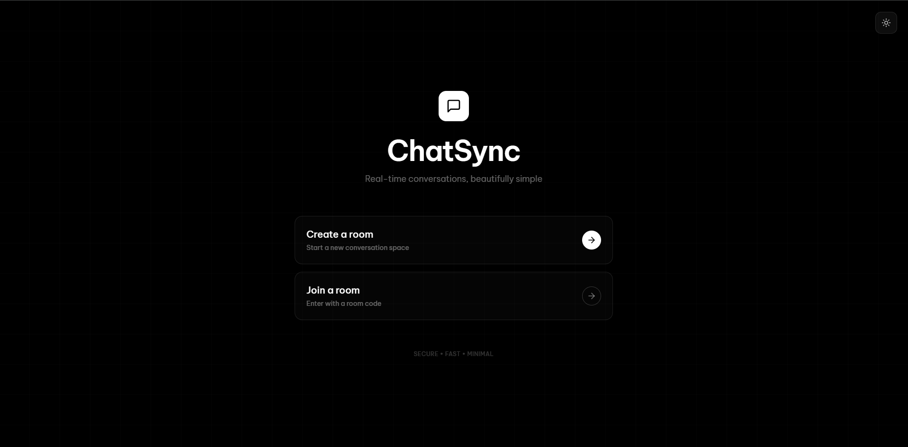
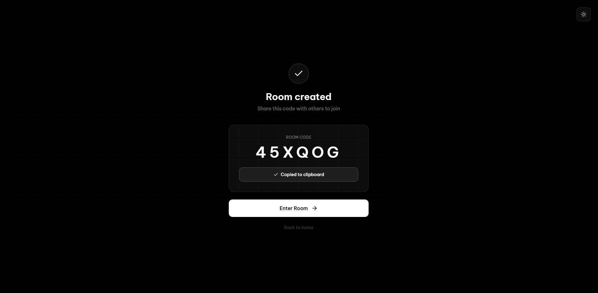
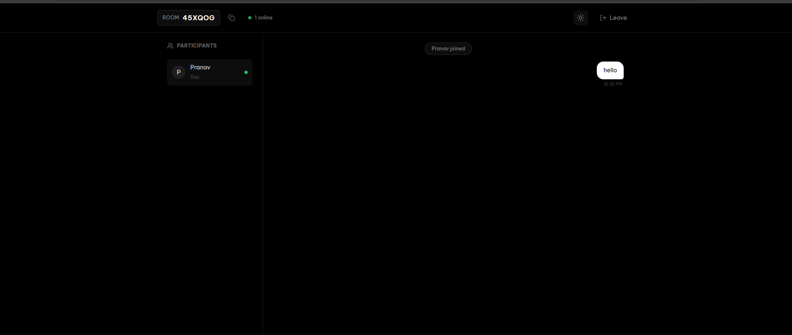

# Hello Chatroom Application 🚀

<p align="center">
  
</p>

<p align="center">
  <strong>A modern, real-time chat application with room management and theme switching</strong>
</p>

<p align="center">
  
  
  
  
</p>

---

# Hello Chatroom

A modern, full-stack chatroom application built with a Spring Boot backend and a React + Vite + Tailwind frontend. Features real-time chat, room management, and seamless dark/light mode switching.

---

## Table of Contents
- [Features](#features)
- [Screenshots](#screenshots)
- [Tech Stack](#tech-stack)
- [Architecture](#architecture)
- [Getting Started](#getting-started)
- [Frontend Usage](#frontend-usage)
- [Backend Usage](#backend-usage)
- [Dark/Light Mode](#darklight-mode)
- [API Endpoints](#api-endpoints)
- [WebSocket Communication](#websocket-communication)
- [What I Learned](#what-i-learned)
- [Challenges Faced](#challenges-faced)
- [Future Enhancements](#future-enhancements)
- [Project Structure](#project-structure)
- [Troubleshooting](#troubleshooting)
- [Contributing](#contributing)
- [License](#license)

---

## Features

### Core Functionality
- 🌐 **Real-time Communication**: Instant messaging using WebSocket technology
- 🏠 **Room Management**: Create, join, and leave chat rooms dynamically
- 👤 **User System**: Username-based identification for all participants
- 📨 **Message Broadcasting**: Messages are delivered to all users in a room instantly
- 🔄 **Connection Status**: Real-time connection status indicators

### User Experience
- 💡 **Theme Switching**: Seamless dark/light mode toggle with persistent preference
- ⚡ **Responsive Design**: Works perfectly on desktop, tablet, and mobile devices
- 🎨 **Modern UI**: Beautiful interface built with Tailwind CSS
- 🚀 **Fast Performance**: Optimized with Vite for lightning-fast load times
- ♿ **Accessible**: WCAG compliant with proper ARIA labels and keyboard navigation

### Technical Features
- 🛡️ **RESTful API**: Clean API design for room and user management
- 🔌 **WebSocket Protocol**: STOMP over WebSocket for reliable messaging
- 🎯 **TypeScript**: Full type safety in the frontend
- 📦 **Maven Build**: Easy backend building and dependency management

---

## Screenshots

### Home Page
<p align="center">
  
</p>

### Chat Room Interface
<p align="center">
  
</p>

### Room Management
<p align="center">
  
</p>

---

## Tech Stack

### Frontend
- **React 18+**: Component-based UI library
- **Vite**: Next-generation frontend tooling for blazing-fast development
- **TypeScript**: Type-safe JavaScript with enhanced IDE support
- **Tailwind CSS**: Utility-first CSS framework for rapid UI development
- **WebSocket Client**: Real-time bidirectional communication
- **React Context API**: State management for theme and user data

### Backend
- **Java 17+**: Modern Java with latest features
- **Spring Boot 3+**: Production-ready framework
- **Spring WebSocket**: WebSocket support with STOMP protocol
- **Maven**: Dependency management and build automation
- **Spring Web**: RESTful API development

### Development Tools
- **ESLint**: Code quality and consistency
- **PostCSS**: CSS transformation and optimization
- **Maven**: Build automation and dependency management

---

## Architecture

This application follows a client-server architecture with WebSocket for real-time communication:

```
┌─────────────────┐         HTTP/REST         ┌─────────────────┐
│                 │◄──────────────────────────►│                 │
│  React Frontend │                            │  Spring Boot    │
│   (Vite + TS)   │         WebSocket          │    Backend      │
│                 │◄──────────────────────────►│   (Java 17+)    │
└─────────────────┘          (STOMP)           └─────────────────┘
```

**Communication Flow:**
1. User connects to frontend (React app served by Vite)
2. Frontend makes REST API calls to create/join rooms
3. WebSocket connection is established for real-time messaging
4. Messages are sent via STOMP protocol and broadcast to all room participants
5. Theme preferences are managed locally using Context API

---

## Getting Started

### Prerequisites
- Node.js (v16+ recommended)
- Java 17 or higher
- Maven

### Clone the Repository
```bash
git clone <your-repo-url>
cd hello
```

---

## Frontend Usage

1. Navigate to the frontend directory:
   ```bash
   cd frontend
   ```
2. Install dependencies:
   ```bash
   npm install
   ```
3. Start the development server:
   ```bash
   npm run dev
   ```
4. Open [http://localhost:5173](http://localhost:5173) in your browser.

---

## Backend Usage

1. In the project root, build and run the Spring Boot backend:
   ```bash
   ./mvnw spring-boot:run
   ```
   or (on Windows):
   ```bash
   mvnw.cmd spring-boot:run
   ```
2. The backend will be available at [http://localhost:8080](http://localhost:8080)

---

## Dark/Light Mode

### Overview
The application features a fully functional dark/light mode toggle system that enhances user experience by providing optimal viewing comfort in different lighting conditions.

### Features
- 🌙 **Dark Mode**: Easy on the eyes in low-light environments
- ☀️ **Light Mode**: Bright and clear for daytime use
- 💾 **Persistent Preference**: Your theme choice is saved in localStorage
- 🎨 **Smooth Transitions**: CSS transitions for seamless theme switching
- 🔄 **Instant Updates**: Theme changes apply immediately across all components

### Implementation Details
- **React Context**: Uses `ThemeContext.tsx` for global theme state management
- **Tailwind Dark Mode**: Leverages Tailwind's built-in dark mode utilities (`dark:` prefix)
- **LocalStorage**: Persists user preference across browser sessions
- **System Preference Detection**: Automatically detects user's OS theme preference on first visit

### Usage
Simply click the theme toggle button (usually a sun/moon icon) in the application header to switch between modes. The preference is automatically saved.

---

## API Endpoints

### REST API

#### Chat Room Management
```
GET    /api/rooms           - Get all chat rooms
POST   /api/rooms           - Create a new chat room
GET    /api/rooms/{id}      - Get room details
DELETE /api/rooms/{id}      - Delete a chat room
```

#### User Management
```
POST   /api/users/join      - Join a chat room
POST   /api/users/leave     - Leave a chat room
GET    /api/users/{roomId}  - Get users in a room
```

---

## WebSocket Communication

### Connection
```javascript
const socket = new SockJS('http://localhost:8080/ws');
const stompClient = Stomp.over(socket);
```

### Subscribe to Room
```javascript
stompClient.subscribe('/topic/room/{roomId}', (message) => {
  // Handle incoming message
});
```

### Send Message
```javascript
stompClient.send('/app/chat/{roomId}', {}, JSON.stringify({
  sender: 'username',
  content: 'message text',
  type: 'CHAT'
}));
```

---

## What I Learned

Building this project was an incredible learning experience. Here are the key takeaways:

### Frontend Development
- **React Context API**: Learned how to manage global state without Redux, specifically for theme management
- **TypeScript Integration**: Gained hands-on experience with TypeScript in a React project, understanding interfaces and type safety
- **Vite Configuration**: Explored modern build tools and their advantages over traditional bundlers
- **Tailwind CSS**: Mastered utility-first CSS and responsive design patterns
- **WebSocket Client**: Implemented real-time communication in a React application

### Backend Development
- **Spring Boot WebSocket**: Configured WebSocket with STOMP protocol for message broadcasting
- **REST API Design**: Created RESTful endpoints following best practices
- **Spring Configuration**: Learned about @Configuration, @Bean, and dependency injection
- **CORS Handling**: Properly configured cross-origin requests for development

### Full-Stack Integration
- **Client-Server Communication**: Bridged frontend and backend using both REST and WebSocket
- **Real-time Systems**: Understood the challenges and solutions for real-time messaging
- **State Synchronization**: Managed state across multiple connected clients

### Development Practices
- **Component Architecture**: Designed reusable and maintainable React components
- **Error Handling**: Implemented proper error boundaries and user feedback
- **Code Organization**: Structured a full-stack project for scalability

---

## Challenges Faced

### 1. WebSocket Connection Management
**Problem**: Managing WebSocket connections and reconnections was tricky, especially handling disconnections gracefully.

**Solution**: Implemented connection status indicators and automatic reconnection logic with exponential backoff.

### 2. Theme Persistence
**Problem**: Initial attempts to persist theme across page reloads weren't working consistently.

**Solution**: Used localStorage with proper serialization and added initialization logic in ThemeContext.

### 3. CORS Configuration
**Problem**: Frontend couldn't communicate with backend due to CORS policy restrictions.

**Solution**: Properly configured `@CrossOrigin` annotations and WebSocket CORS settings in Spring Boot.

### 4. Message Broadcasting
**Problem**: Ensuring messages only reach users in the same room required careful routing.

**Solution**: Used room-specific WebSocket topics (`/topic/room/{roomId}`) for targeted message delivery.

### 5. Type Safety
**Problem**: Ensuring type safety between frontend and backend data structures.

**Solution**: Created matching TypeScript interfaces and Java models with proper validation.

---

## Future Enhancements

- [ ] **User Authentication**: Add JWT-based authentication and authorization
- [ ] **Private Messaging**: Enable direct messages between users
- [ ] **File Sharing**: Allow users to share images and files in chat
- [ ] **Message History**: Persist chat messages in a database
- [ ] **Typing Indicators**: Show when other users are typing
- [ ] **Read Receipts**: Track message read status
- [ ] **Emoji Support**: Add emoji picker and reactions
- [ ] **User Profiles**: Allow users to customize their profiles with avatars
- [ ] **Room Passwords**: Add password protection for private rooms
- [ ] **Admin Controls**: Implement room moderation features
- [ ] **Push Notifications**: Browser notifications for new messages
- [ ] **Docker Deployment**: Containerize the application for easy deployment
- [ ] **Database Integration**: Add PostgreSQL or MongoDB for data persistence
- [ ] **Testing**: Add comprehensive unit and integration tests

---

## Project Structure

```
hello/
├── frontend/
│   ├── public/
│   │   ├── logo.png
│   │   ├── screenshot1.png
│   │   └── screenshot2.png
│   ├── src/
│   │   ├── App.tsx
│   │   ├── context/ThemeContext.tsx
│   │   └── pages/
│   │       ├── Chatroom.tsx
│   │       ├── CreateRoom.tsx
│   │       ├── HomePage.tsx
│   │       └── JoinRoom.tsx
│   └── ...
├── src/main/java/com/pranav/hello/
│   ├── controller/
│   ├── model/
│   ├── service/
│   └── config/
└── ...
```

---

## Troubleshooting

### Frontend Issues

**Problem**: `npm install` fails
```bash
# Solution: Clear npm cache and retry
npm cache clean --force
rm -rf node_modules package-lock.json
npm install
```

**Problem**: Port 5173 already in use
```bash
# Solution: Kill the process or use a different port
npm run dev -- --port 5174
```

### Backend Issues

**Problem**: Maven build fails
```bash
# Solution: Clean and rebuild
./mvnw clean install
```

**Problem**: Port 8080 already in use
```bash
# Solution: Change port in application.properties
server.port=8081
```

### WebSocket Issues

**Problem**: WebSocket connection fails
- Check that backend is running on http://localhost:8080
- Verify CORS configuration in WebSocketConfig.java
- Check browser console for detailed error messages

---

## Contributing

Contributions are welcome! Please open issues or submit pull requests for improvements and bug fixes.

---

## License

This project is licensed under the MIT License.
